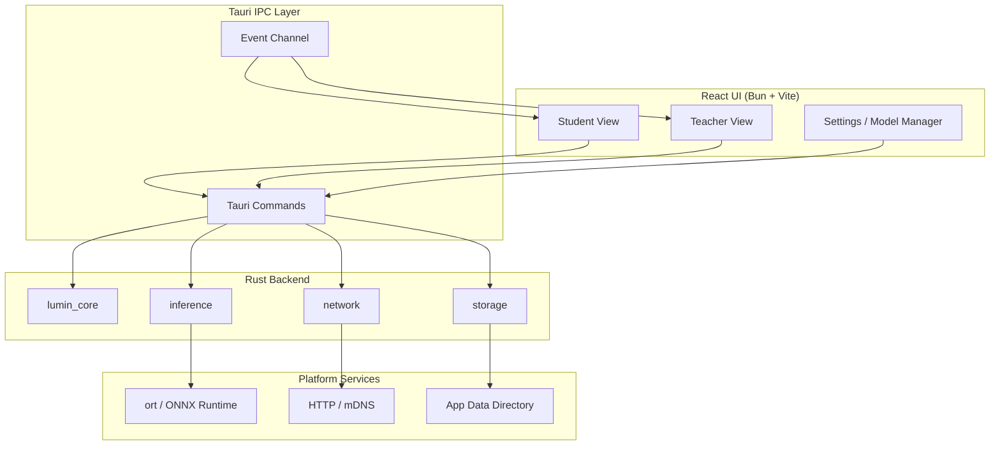
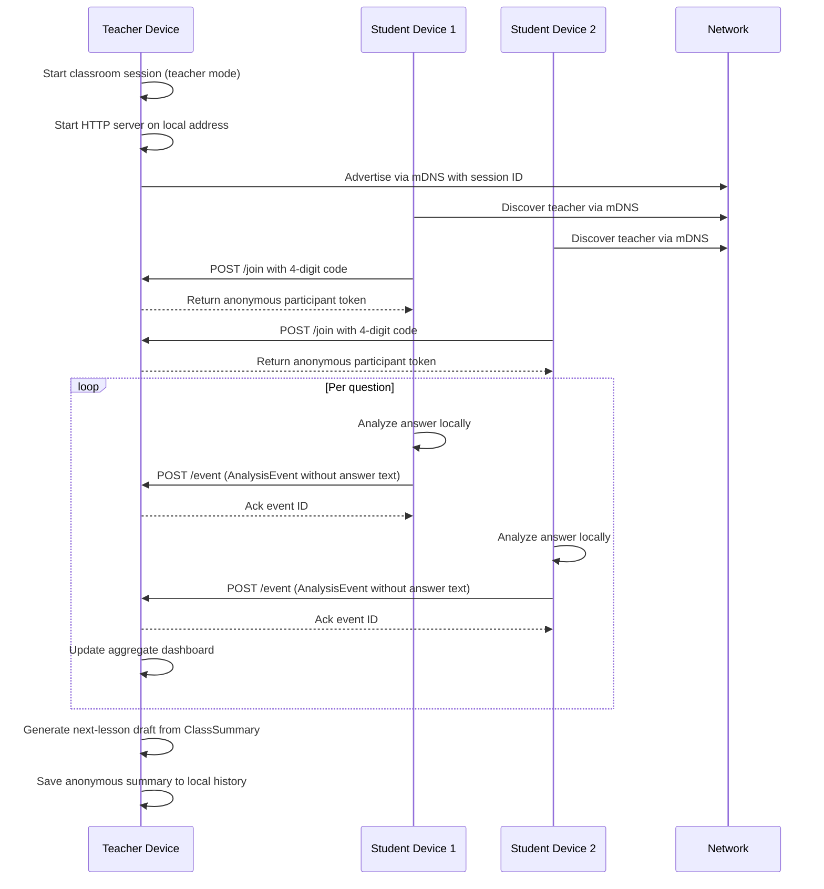

# Lumin Architecture Overview

Lumin is a local-first learning companion built with Tauri. The frontend is React running on Bun and Vite. The backend is Rust. All inference and classroom analytics stay on the device unless a student explicitly joins a teacher session. Network traffic is limited to metadata-sized `AnalysisEvent` messages over the local network.

## Component Architecture

### Frontend

The React frontend renders two primary modes from a single app.

- **Student View**: question cards, answer input, three-stage hints, retry flow.
- **Teacher View**: session setup, live aggregate dashboard, next-lesson draft editor, history.
- **Settings / Model Manager**: download Gemma 3 1B INT4, select execution provider, check disk space.

Frontend code calls Rust through `invoke("command_name")` and listens to events such as `session-discovered`, `analysis-event-ack`, or `download-progress`.

### Tauri IPC Layer

Tauri exposes typed commands and events between JavaScript and Rust.

- Commands are defined in `src-tauri/src/lib.rs`.
- Capabilities live in `src-tauri/capabilities/default.json`.
- Long-running work uses Tauri events instead of blocking command returns.

### Rust Backend

The backend is split into modules by responsibility.

| Module | Responsibility |
| --- | --- |
| `lumin_core` | Question bank, answer analysis, misconception labels, class summaries, lesson-plan drafts |
| `inference` | `ort` session management, tokenizer, Gemma 3 1B INT4 generation, CPU / GPU execution providers |
| `network` | Teacher HTTP server, student HTTP client, mDNS service discovery, join-code validation |
| `storage` | App data directory access, offline queue, session history, model cache |

## Classroom Session Data Flow

Teacher mode starts an HTTP server on the local network. Students discover it through mDNS and connect with a 4-digit join code. After validation, each student receives an anonymous token. Students analyze their answers on-device and send only `AnalysisEvent` metadata to the teacher. The teacher dashboard aggregates events and produces a 10-minute next-lesson draft from the `ClassSummary`.

## Privacy Boundary

The privacy model is enforced by design. Answer text never leaves the student device.

### Stays on the student device

- The full answer text entered by the student
- Intermediate answer state
- Hints shown to the student
- Raw inference outputs used for personalization

### Travels to the teacher device

- Anonymous session token
- Question ID and concept tag
- Misconception label
- First-try correctness, hint count, retry result

### Stays on the teacher device

- Aggregate dashboards
- Edited lesson-plan drafts
- Anonymous session history (up to 100 items)

If the network drops, student `AnalysisEvent` objects are queued locally. They are re-sent after reconnection and removed only when the teacher acknowledges the event ID. Teacher history is stored in the app data directory and can be deleted from the UI.

## Model and Inference Stack

Planned inference uses Rust `ort` (ONNX Runtime) with the Gemma 3 1B INT4 model.

- Model source: Hugging Face `onnx-community/gemma-3-1b-it-ONNX`
- Runtime: `ort` with CPU by default, execution providers switched via Cargo features
- Execution providers: CoreML on Apple Silicon / iOS, NNAPI / XNNPACK on Android, CUDA / DirectML on desktop where available
- Tokenizer: SentencePiece-based `tokenizer.json`
- Model storage: app data directory, verified by SHA256 after download

The inference module does not call external services. Generation happens entirely on-device.

## Current Scaffold State

At this stage the repository contains a working Tauri + React scaffold.

- `src-tauri/src/lib.rs` exposes `greet` and `get_system_info` commands only.
- `src/App.tsx` shows a scaffold UI to confirm the IPC pipeline.
- `inference`, `network`, and `lumin_core` modules are not yet implemented.
- The `docs/architecture/` folder is the first documentation being added.

The architecture above describes the target design that the scaffold will grow into.
